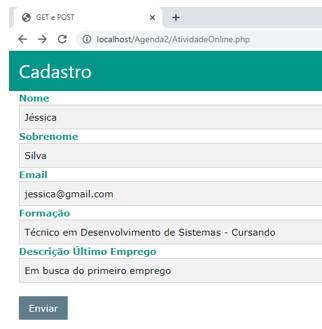

# Fichário
## Agenda 02 - Desenvolvimento de Sistemas II » Apresentação » Introdução ao Fichário » Fichário

Jéssica após realizar os estudos sobre tipos de variáveis e métodos de requisição, recebeu sua primeira oportunidade, ela ficou responsável por criar o back-end da página de cadastro, para o site das Lojas Brincos e Companhia, mas esse cadastro não é para cliente e, sim, para possíveis colaboradores. Sua chefia, encaminhou a página de cadastro e solicitou:

1. Que todos os campos: Nome, sobrenome, email, formação e descrição do último empregos fossem armazenados em variáveis adequadas.

2. Que uma mensagem de confirmação (Cadastro Confirmado com sucesso) e dados cadastrados fossem exibidos para o usuário. (Imagem 13).

Imagem 1: Exemplo de mensagem para atividade online.

Vamos ajudar a Jéssica a Desenvolver esta atividade!

Dicas:

- Você pode utilizar html e css para deixar o seu site mais agradável.
- Segue abaixo, o cadastro e seu código fonte para desenvolvimento da atividade.

Imagem 2: Cadastro passado pela chefia.

Utilize o código a seguir dentro do arquivo php do cadastro.

~~~html
<!DOCTYPE html>
<html lang="pt-BR">
<head>
    <meta charset="UTF-8">
    <meta name="viewport" content="width=device-width, initial-scale=1.0">
    <meta http-equiv="X-UA-Compatible" content="ie=edge">
    <link rel="stylesheet" href="https://www.w3schools.com/w3css/4/w3.css">
    <title>GET e POST</title>
</head>

<body>
  

    <h2>Cadastro</h2>
  

  <form class="w3-container" method="post" action="AtividadeOnlineAction.php">
    <label class="w3-text-teal"><b>Nome</b></label>
    <input class="w3-input w3-border w3-light-grey" name="txtNome" type="text">
    <label class="w3-text-teal"><b>Sobrenome</b></label>
    <input class="w3-input w3-border w3-light-grey" name="txtSobrenome" type="text">
    <label class="w3-text-teal"><b>Email</b></label>
    <input class="w3-input w3-border w3-light-grey" name="txtEmail" type="text">
    <label class="w3-text-teal"><b>Formação</b></label>
    <input class="w3-input w3-border w3-light-grey" name="txtFormacao" type="text">
    <label class="w3-text-teal"><b>Descrição Último Emprego</b></label>
    <input class="w3-input w3-border w3-light-grey" name="txtEmprego" type="text">
     
    <button class="w3-btn w3-blue-grey">Enviar</button>
  </form>
</body>
</html>
~~~