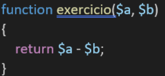
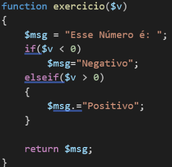
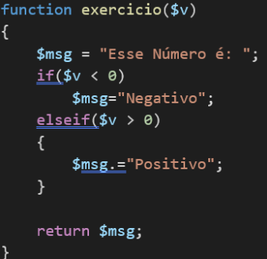

<h2>Estudando PHP 🐘</h2>

Disciplina: Desenvolvimento de Sistemas II - ETEC

<h2>Agenda 04: PHP - Estrutura de repetição e funções.</h2>

## Funções ⚙️

- São `blocos de código` com um nome.
- Objetivo: executar uma tarefa específica e, por meio de seu nome ser invocada e, posteriormente executada, em diversas
partes do código. 
- É uma das primeiras e mais utilizadas técnicas para reutilização de código.
- Iniciada com a palavra reservada `function`.

Sintaxe:
~~~php
function nome_da_funcao ($arg_1, $arg_2, /* ... */ $arg_n) {
 // Bloco de código
 return $valor_retornado;
}
~~~

As funções em php podem ser dos tipos:
- void: apenas executam instruções determinadas e não devolvem nenhum valor como resultado.
- com retorno: ao serem executadas, devolvem um valor ao fim de sua execução.

> Importante: O PHP não diferencia letras maiúsculas de minúsculas para o nome de funções!!!

E, para melhor entendimento:

> arquivos `exemploFuncao.php` e `exemploFuncaoAction.php`

### Funções nativas:

No php, há uma lista de [funções nativas](https://www.php.net/manual/pt_BR/indexes.functions.php), que auxiliam o desenvolvimento. 
Atentar-se às versões do php que suportam essa função.

---

## Estruturas de repetição

### 1. `FOR`

Sintaxe:

~~~php
for ([inicialização];[condição];[incremento ou decremento]) {
  [instrucoes];
}
~~~

Exemplo:

> arquivos `exemploFor.php` e `exemploForAction.php`

---

### 2. `WHILE`

Sintaxe:

~~~php
while (expressão) {
  [instrucoes];
}
~~~

Exemplo:

> arquivos `exemploWhile.php` e `exemploWhileAction.php`

---

### 3. `DO WHILE`

A primeira iteração é sempre executada, pois sua expressão booleana (condição) é realizada apenas no fim da estrutura!

Sintaxe:

~~~php
do {
  [instrucoes];
} while (expressão);
~~~

Exemplo:

> arquivos `exemploDoWhile.php` e `exemploDoWhileAction.php`

---

### 4. `FOREACH`

- desenvolvido para gerar iterações para o uso em arrays e objetos no PHP!

> Obs.: Comando break tem a função de parar a execução de laços de repetição.

Exemplo de aplicação do comando break:

~~~php
$i = 0;

while (true) { //Loop infinito.
 if ($i > 10) {
  break;
 }
 echo $i." ";
 $i++;
}
~~~

> Obs.: Comando continue tem a função de pular a iteração na qual foi executado, passando para a próxima iteração do laço, continuando assim o loop.

Exemplo de aplicação do comando continue:

~~~php
$i = 0;

for($i = 0; $i <=10; $i++) {
 if ($i == 5) {
  continue;
 }
 echo $i." ";
}
~~~

---

### Você no comando:

Utilizando o que foi visto até agora, vamos criar uma página completa para mãe de Karla. 

1. Crie um arquivo PHP na pasta root ou Agenda4. 

a) Crie uma divisão e coloque a data atual centralizada na Página. 
b) Divida a página em três:

- Parte 1: Clicar em um botão para gerar a Tabuada respectiva ao número do botão;
- Parte 2: Digitar o valor e clicar para gerar a tabuada do valor digitado;
- Parte 3: Clicar em um botão para gerar todas as tabuadas;

2. Crie um arquivo PHP para receber todas as ações possíves do arquivo anterior e exibir as tabuadas requeridas. 
Dicas: 
- Procure pela função nativa date().
- Utilize o exemplo de cada estrutura de repetição
- Utilize o comando isset para verificar qual botão foi acionado.

> arquivos `voceNoComando.php` e `voceNoComandoAction.php`

---

## Simulado

### Questao 01:

Dada a função a seguir:

Como seria a chamada desta função para um retorno de valor 10?

> exercicio(20,10)

### Questao 02:

Karla deseja criar uma página que exiba todos os números ímpares de 1 a 100. Qual das alternativas demonstra uma possível resolução.

~~~php
$i = 1; 
while ($i <= 99) { 
  echo $i." "; 
  $i++; 
  $i++;
}
~~~

### Questao 03

Dada a função a seguir:

Qual o valor de retorno caso a chamada da função seja exercício(0):

> Esse Número é:

### Questao 04

Qual das estruturas de repetição tem como característica a execução da primeira iteração independende de sua condição.

> Do-While

### Questao 05

Dada a função a seguir:

Qual o valor de retorno caso a chamada da função seja exercício( -10 ):

> Negativo

[Voltar ao início.](https://github.com/monicaquintal/disciplina_DS_II_ETEC)