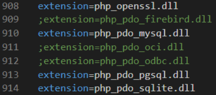

<h2>Estudando PHP 🐘</h2>

Disciplina: Desenvolvimento de Sistemas II - ETEC

<h2>Agenda 07: PHP - Persistência de dados (parte 2).</h2>
<h3>PDO</h3>

## PDO

### O que é?

Trata-se de uma interface `PHP Data Objects` (PDO) que, ao ser implementada, fornece uma camada de abstração em relação a conexão com o banco de
dados.

### Vantagem

Efetuar a conexão com diversos bancos de dados da mesma forma, alterando baiscamente sua string de conexão.

### PDO x MySqli

&#32; | PDO | MySQLi
------|-----|-------
Suporte a Bancos de Dados | 12 drivers diferentes | Somente MySQLi
API | Orientada a Objetos | Orientada a Objetos + Procedural
Conexão | Fácil | Fácil
Parâmetros nomeados | Sim | Não
Mapeamento de Objetos | Sim | Sim
Sentenças Preparadas (lado do cliente) | Sim | Não 
Performance | Rápido | Mais rápido
Procedimentos armazenados | Sim | Sim

### Observação importante

Em alguns casos, o PDO deve ser habilitado no servidor para ter seu funcionamento adeuqado. No caso do USBWebServer, é possível ser habilitado a partir do arquivo php.ini, localizado na pasta settings, removendo o comentário (;) da extension=php_pdo_mysql.dll.

Em outros servidores talvez também seja necessário, a ativação do: extension=php_pdo.dll, que também é realizada removendo o (;).

---

## Vamos começar!

1. Criando a base de dados denominada “pwiii”:

~~~sql
CREATE DATABASE `pwiii`;
~~~

2. Criando a tabela "produto":

~~~sql
CREATE TABLE `pwii`.`produto` (
 `idproduto` INT NOT NULL AUTO_INCREMENT,
 `nome` VARCHAR(45) NOT NULL,
 `preco` FLOAT NOT NULL,
 `quantidade` INT NOT NULL,
 PRIMARY KEY (`idproduto`));
~~~

3. Criação do arquivo [index.php](./atividade-agenda/index.php).

4. Criação do arquivo [cadastro.php](./atividade-agenda/cadastro.php).

5. Criação do arquivo [cadastroAction.php](./atividade-agenda/cadastroAction.php).

- neste arquivo, terá a conexão com o banco de dados através do PDO, a criação e execução da sentença sql de insert, e por fim uma mensagem de sucesso ou fracasso.
- para criar a conexão, continuamos com a boa prática criar variáveis para armazenar o nome do servidor, nome do usuário, senha e por fim o nome da base de dados. Neste momento criamos uma instância do driver PDO.

6. Criação do arquivo [listar.php](./atividade-agenda/listar.php)

- Deve conter uma tabela com seis campos (ID, Nome, Preco, Quantidade, Remover e Atualizar produto).
- Para a montagem desta tabela, vamos utilizar os dados salvos no banco de dados e vamos precisar novamente:
  - Criar instância Mysqli
  - Verificar conexão.
  - Criar sentença SQL.

7. Criação do arquivo [excluir.php](./atividade-agenda/excluir.php).

- formulário com campos nome, preco e quantidade desabilitados.
- um botão para confirmar a exclusão.
- um link para cancelar a exclusão.

8. Criação do arquico [excluirAction.php](./atividade-agenda/excluirAction.php).

- Criar instância MySQLi.
- Verificar conexão.
- Criar sentença DELETE.
- Executar a sentença verificando se mesma obteve sucessso.
- Gerar mensagems de sucesso e falha com link para o arquivo listar.php.

### Métodos prepare() e bindParam()

O `método prepare()` tem a função apenas de iniciar uma sentença SQL.

Na presença de um caracter de interrogaçao (?), este caracter será substituido pelos valores adicionados, através do uso método bindParam.

O `método bindParam` utiliza passagens de parâmetros. A posição da interrogação será substituída (caso existam mais de uma interrogação, para cada uma delas é dada um número em ordem crescente da direita para esquerda). Um parâmetro $_POST[parametro], por sua ves, se destinará ao valor que será inserido na sentença sql. 

9. Arquivo [atualizar.php](./atividade-agenda/atualizar.php).

- formulário com inputs para o nome, preço e quantidade.
- receberá os dados oriundos do método get do arquivo “listar.php”.
- garante a possibilidade do usuário realizar alterações e o update através de botão “atualizar”.

10. Arquivo [atualizarAction.php](./atividade-agenda/atualizarAction.php).

- Criar instância PDO.
- Verificar conexão.
- Criar sentença Update.
- Executar a sentença verificando se mesma obteve sucessso.
- Gerar mensagems de sucesso e falha com link para o arquivo listar.php.

---

## Você no Comando

"Utilizando o que foi visto até agora, foi criada uma tabela no banco de dados com o nome: estado, com os atributos idestado (auto
incremento, int11), nome (varchar45) e sigla (varchar2).

A) Obtenha os dados da tabela, utilizando o driver PDO.  
B) Crie uma tabela no navegado utilizando os dados obtidos através da consulta ao banco de dados e exiba no navegador."

1. Criando a tabela estado:

~~~sql
CREATE TABLE `pwii`.`estado` (
 `idestado` INT NOT NULL AUTO_INCREMENT,
 `nome` VARCHAR(45) NOT NULL,
 `sigla` VARCHAR(2) NOT NULL,
 PRIMARY KEY (`idestado`));
~~~

2. Inserindo registros:

~~~sql
INSERT INTO `pwii`.`estado` (`nome`, `sigla`) VALUES ('Acre','AC');
INSERT INTO `pwii`.`estado` (`nome`, `sigla`) VALUES ('Alagoas','AL');
INSERT INTO `pwii`.`estado` (`nome`, `sigla`) VALUES ('Amapá','AP');
INSERT INTO `pwii`.`estado` (`nome`, `sigla`) VALUES ('Amazonas','AM');
INSERT INTO `pwii`.`estado` (`nome`, `sigla`) VALUES ('Bahia','BA');
INSERT INTO `pwii`.`estado` (`nome`, `sigla`) VALUES ('Ceará','CE');
INSERT INTO `pwii`.`estado` (`nome`, `sigla`) VALUES ('Espírito Santo','ES');
INSERT INTO `pwii`.`estado` (`nome`, `sigla`) VALUES ('Goiás','GO');
INSERT INTO `pwii`.`estado` (`nome`, `sigla`) VALUES ('Maranhão','MA');
INSERT INTO `pwii`.`estado` (`nome`, `sigla`) VALUES ('Mato Grosso','MT');
INSERT INTO `pwii`.`estado` (`nome`, `sigla`) VALUES ('Mato Grosso do Sul','MS');
INSERT INTO `pwii`.`estado` (`nome`, `sigla`) VALUES ('Minas Gerais','MG');
INSERT INTO `pwii`.`estado` (`nome`, `sigla`) VALUES ('Pará','PA');
INSERT INTO `pwii`.`estado` (`nome`, `sigla`) VALUES ('Paraíba','PB');
INSERT INTO `pwii`.`estado` (`nome`, `sigla`) VALUES ('Paraná','PR');
INSERT INTO `pwii`.`estado` (`nome`, `sigla`) VALUES ('Pernambuco','PE');
INSERT INTO `pwii`.`estado` (`nome`, `sigla`) VALUES ('Piauí','PI');
INSERT INTO `pwii`.`estado` (`nome`, `sigla`) VALUES ('Rio de Janeiro','RJ');
INSERT INTO `pwii`.`estado` (`nome`, `sigla`) VALUES ('Rio Grande do Norte','RN');
INSERT INTO `pwii`.`estado` (`nome`, `sigla`) VALUES ('Rio Grande do Sul','RS');
INSERT INTO `pwii`.`estado` (`nome`, `sigla`) VALUES ('Rondônia','RO');
INSERT INTO `pwii`.`estado` (`nome`, `sigla`) VALUES ('Roraima','RR');
INSERT INTO `pwii`.`estado` (`nome`, `sigla`) VALUES ('Santa Catarina','SC');
INSERT INTO `pwii`.`estado` (`nome`, `sigla`) VALUES ('São Paulo','SP');
INSERT INTO `pwii`.`estado` (`nome`, `sigla`) VALUES ('Sergipe','SE');
INSERT INTO `pwii`.`estado` (`nome`, `sigla`) VALUES ('Tocantins','TO');
INSERT INTO `pwii`.`estado` (`nome`, `sigla`) VALUES ('Distrito Federal','DF');
~~~

3. Codificando para exibição da lista:

O resultado encontra-se no arquivo [voceNoComando.php](./voceNoComando/voceNoComando.php).

---

## Atividade da Semana

A atividade consiste em um Questionário, que pode ser acessado [aqui](./questionario_agenda07_ds_ii.pdf).

--- 

[Voltar ao início.](https://github.com/monicaquintal/disciplina_DS_II_ETEC)